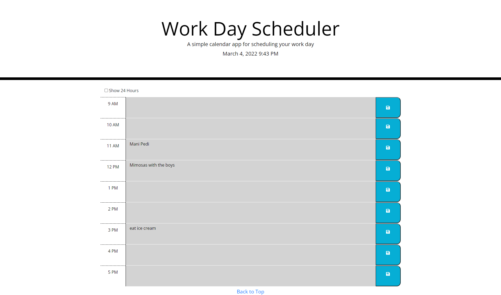

## Day Planner
[Live Site](https://ekerseyc.github.io/day-planner/)

## Table of Contents
1. [Description](#Description)
2. [Visual](#Visual)

## Description
A work day planner made in jQuery using Moment.js to calculate the time by the hour. The save option will save to the user's local storage.

## Visual

